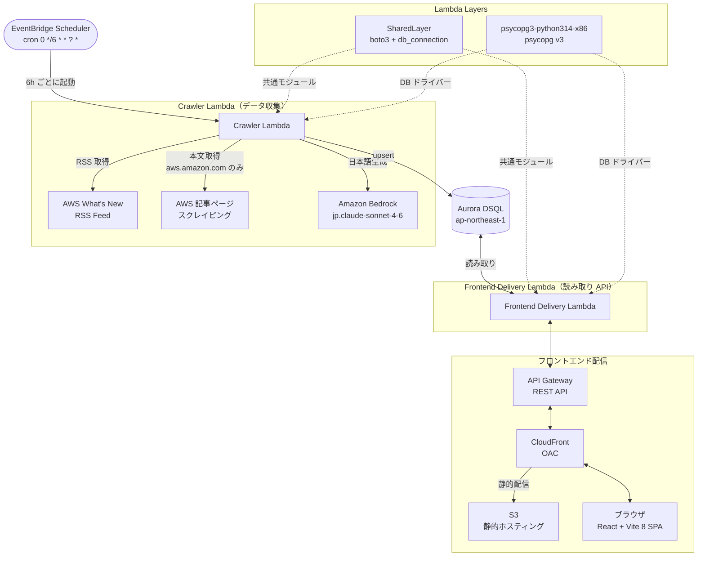

# AWS Update Check Collection

AWS の新機能・アップデート情報を 6時間ごとに自動収集し、日本語タイトル・要約・活用例付きで閲覧できるシステムです。

## 機能概要

- **自動収集**: AWS What's New の RSS フィードを 6時間ごとに取得（変更可）
- **日本語化**: Amazon Bedrock (jp.anthropic.claude-sonnet-4-6) でタイトル・要約・活用例を自動生成
- **一覧・検索**: 日付範囲・カテゴリ・キーワードでフィルタリング
- **詳細表示**: ページ要約 → 活用例 → 参照元URL → 英語原文 の順で表示

## アーキテクチャ



## ディレクトリ構成

```
aws_update_check_collection/
├── backend/
│   ├── shared/               # SharedLayer (両 Lambda 共通)
│   │   ├── db_connection.py  # Aurora DSQL 接続共通ロジック（トークン取得・接続）
│   │   └── requirements.txt  # boto3
│   ├── crawler/              # Crawler Lambda
│   │   ├── handler.py        # Lambda エントリポイント（通常収集 / 再処理 / マイグレーション）
│   │   ├── rss_fetcher.py    # RSS フィード取得・パース
│   │   ├── page_scraper.py   # 記事本文スクレイピング（ドメインホワイトリスト制限あり）
│   │   ├── bedrock_client.py # Bedrock API 呼び出し（title_ja / page_summary_ja / use_cases_ja 生成）
│   │   ├── db_client.py      # Aurora DSQL 書き込み（SharedLayer の db_connection を使用）
│   │   └── requirements.txt  # feedparser / requests / beautifulsoup4
│   ├── api/                  # API Lambda
│   │   ├── handler.py        # ルーティング・クエリ処理
│   │   ├── db_client.py      # Aurora DSQL 読み取り（SharedLayer の db_connection を使用）
│   │   └── requirements.txt  # (パッケージなし)
│   └── migrations/
│       └── 001_create_aws_updates.sql  # テーブル・インデックス定義
├── frontend/                 # React + Vite 8 + TypeScript + Tailwind CSS
│   └── src/
│       ├── components/
│       │   ├── UpdateCard.tsx    # 一覧カード（日本語タイトル・要約・活用例プレビュー）
│       │   ├── UpdateDetail.tsx  # 詳細モーダル
│       │   ├── UpdateList.tsx    # 一覧・ページネーション
│       │   └── FilterBar.tsx     # 日付・カテゴリ・キーワードフィルター
│       ├── api/updates.ts        # API 呼び出し関数
│       └── types/update.ts       # 型定義
└── infra/
    ├── template.yaml         # AWS SAM テンプレート
    └── deploy.sh             # デプロイスクリプト
```

## データベーススキーマ

### テーブル: `aws_updates`

| カラム | 型 | 説明 |
|---|---|---|
| `id` | UUID | プライマリキー |
| `published_date` | DATE | AWS 公開日 |
| `title` | VARCHAR(500) | 英語タイトル（RSS 原文） |
| `title_ja` | VARCHAR(500) | 日本語タイトル（Bedrock 生成） |
| `summary_en` | TEXT | 英語概要（RSS 原文） |
| `source_url` | VARCHAR(1000) | 記事 URL（UNIQUE キー） |
| `page_summary_ja` | TEXT | 日本語要約 300字（Bedrock 生成） |
| `use_cases_ja` | TEXT | 活用例 箇条書き（Bedrock 生成） |
| `category` | VARCHAR(200) | AWS カテゴリタグ |
| `collected_at` | TIMESTAMP | 収集日時 |

## UI で表示する項目

### 一覧カード
| 項目 | 内容 |
|---|---|
| 掲載日 | AWS が公開した日付 |
| タイトル | 日本語タイトル（`title_ja`） |
| ページ要約 | 日本語要約の冒頭部分 |
| 活用例 | 箇条書き（最大3件プレビュー） |
| カテゴリ | AWS サービスカテゴリバッジ |

### 詳細モーダル（表示順）
1. ページ要約（日本語）
2. 活用例（箇条書き・全件）
3. 参照元URL
4. 英語原文

## AWS リソース構成

| リソース | 詳細 |
|---|---|
| Crawler Lambda | Runtime: python3.14, Architecture: x86_64, Timeout: 60秒 |
| API Lambda | Runtime: , Architecture: x86_64 |
| Lambda Layer (psycopg3) | psycopg v3 (psycopg3-python314-x86) — Aurora DSQL 接続用 |
| Lambda Layer (SharedLayer) | boto3 + db_connection — 両 Lambda 共通モジュール（SAM 自動ビルド） |
| Aurora DSQL | リージョン: ap-northeast-1, IAM 認証（`dsql:DbConnectAdmin`） |
| Amazon Bedrock | モデル: `jp.anthropic.claude-sonnet-4-6`（クロスリージョン推論プロファイル） |
| API Gateway | REST API, CORS: カスタムドメイン設定時はそのドメインのみ許可・未設定時は全オリジン許可, レート制限: 50 req/s (バースト 100) |
| S3 | フロントエンド静的ホスティング（パブリックアクセス全ブロック） |
| CloudFront | OAC 経由で S3 アクセス。カスタムドメインは `--custom-domain` で設定可能（ACM 証明書は us-east-1 で発行が必要） |
| EventBridge Scheduler | `cron(0 */6 * * ? *)` = 6時間ごと (UTC) |

## ローカル開発

```bash
cd frontend
pnpm install
VITE_API_BASE_URL=https://<api-id>.execute-api.ap-northeast-1.amazonaws.com/prod \
  pnpm dev
```

> カスタムドメイン未設定時は CORS が全オリジン許可のためローカルから直接 API を呼び出せます。カスタムドメインを設定している場合は CORS エラーになります。

## セットアップ・デプロイ

詳細な手順は [DEPLOY.md](./DEPLOY.md) を参照してください。

## 注意事項

- **Aurora DSQL**: `CREATE INDEX ASYNC` 構文が必要（`DESC` インデックスは非対応）
- **Bedrock モデル**: `jp.anthropic.claude-sonnet-4-6` はクロスリージョン推論プロファイルのため、IAM ポリシーの `Resource` は `*` または `inference-profile/` ARN 形式が必要
- **Lambda タイムアウト**: 全 Lambda 共通で 60秒（`template.yaml` の `Globals.Function.Timeout` で設定）
- **CORS**: カスタムドメイン設定時はそのオリジンのみ許可。未設定時は全オリジン許可（公開読み取り専用 API のため）
- **レート制限**: API Gateway は 50 req/s（バースト 100）に制限。超過時は `429 Too Many Requests` を返す
- **検索クエリ文字数**: `q`（キーワード検索）は最大 200 文字、`category` は最大 100 文字
- **スクレイピング**: `aws.amazon.com` および `amazonaws.com` ドメインのみ対象。それ以外の URL は本文取得をスキップ（SSRF 対策）
- **IAM スコープ**: 本番環境では `--dsql-cluster-id` を指定して DSQL へのアクセスを特定クラスターに限定することを推奨
